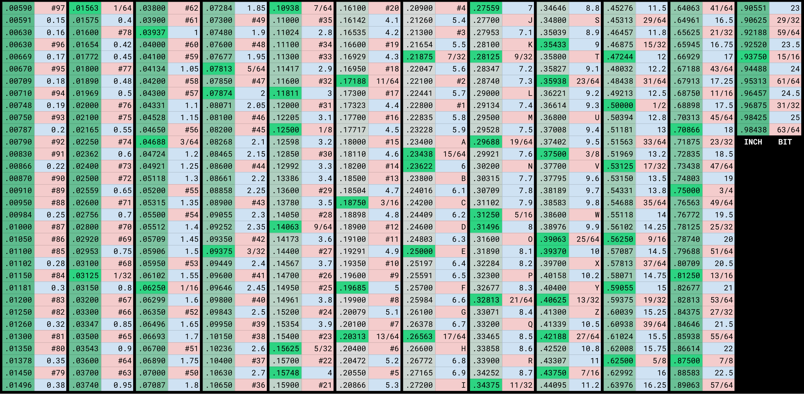

# Drill Bit Size Chart

A compact reference table for metric, fractional-inch, number, and letter drill-bit sizes, ordered by nominal diameter.

## Download and edit

* [Download the PDF chart](drill-bit-size-chart-pdf.pdf)
* [Open the Google Sheet](https://docs.google.com/spreadsheets/d/1qfdDHztWA-5Ba4WcGwthZKbyoiVVLVKIqEtIyo48oEs/edit?usp=sharing) for additional viewing and export options, or you can copy it to your own google drive and edit as you like.

## Example

My personal color preference, highlighting common values and using blue for metric red for non-metric.

Tailored for "at a glance" usage:



## Data

`drill-bit-sizes.csv` is the machine-readable version of the chart with two columns:

* `INCH` — nominal diameter in decimal inches, stored to six decimal places.
* `BIT` — the standard bit designation. Metric sizes include `mm`; fractional-inch sizes are written as fractions without an inch mark; number and letter drills retain their usual designations.

Example:

```csv
INCH,BIT
0.076772,1.95 mm
0.078125,5/64
0.078500,#47
```

The values are nominal reference sizes. Actual drill dimensions and tolerances can vary by manufacturer and tooling standard.

## License

Released under [CC0 1.0 Universal](LICENSE). You may copy, modify, redistribute, and incorporate the data into other projects without attribution.
